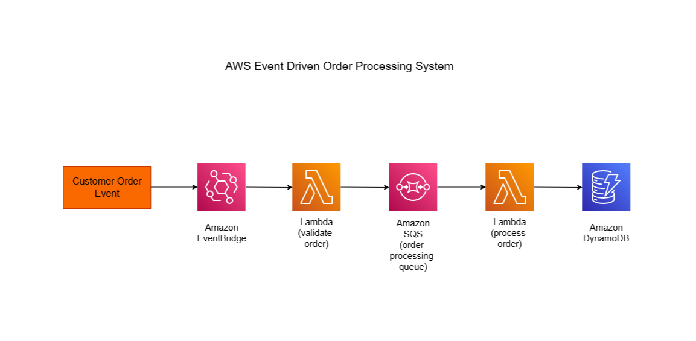
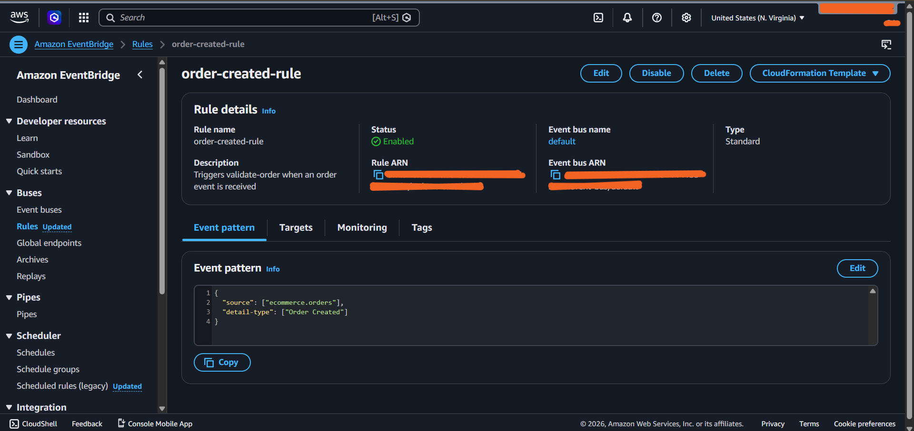
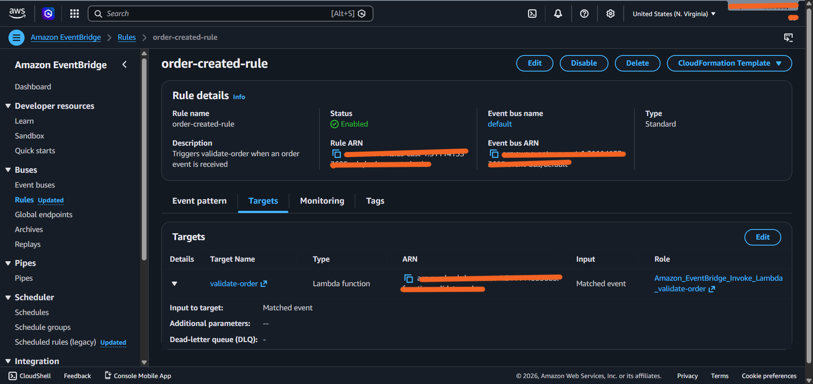
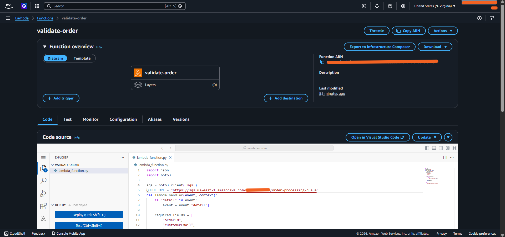
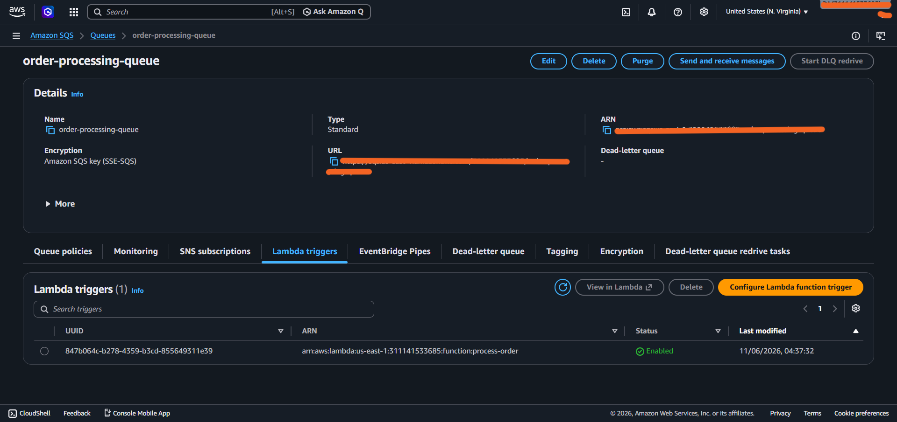
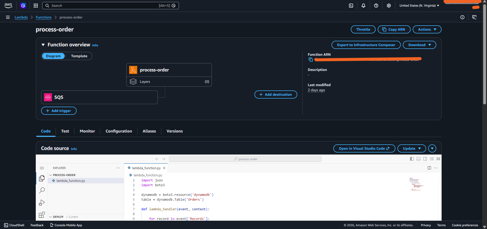
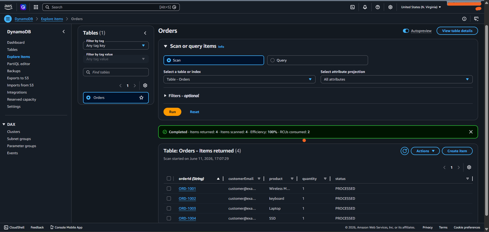

# 🚀 AWS Event-Driven Order Processing System

## 📌 Overview

This project demonstrates a serverless, event-driven order processing workflow using AWS services.

When an order event is published to Amazon EventBridge, it is validated by AWS Lambda, sent to Amazon SQS for asynchronous processing, and then stored in Amazon DynamoDB.

The architecture showcases how modern cloud-native applications use events, queues, and serverless services to build scalable and loosely coupled systems.

---

## 🏗️ Architecture Diagram

---

## 🛠️ AWS Services Used

- Amazon EventBridge
- AWS Lambda
- Amazon SQS
- Amazon DynamoDB
- AWS Identity and Access Management (IAM)

---

## 🧠 How It Works

### Step 1: Order Event Creation

A customer order event is published to Amazon EventBridge.

### Step 2: Event Validation

EventBridge triggers the `validate-order` Lambda function, which validates the incoming order data.

### Step 3: Queueing Orders

Validated orders are sent to Amazon SQS for reliable and asynchronous processing.

### Step 4: Order Processing

The `process-order` Lambda function is automatically triggered when a message arrives in the queue.

### Step 5: Data Storage

Processed order details are stored in the DynamoDB `Orders` table.

---

## 📸 Screenshots

### EventBridge Rule Configuration

### EventBridge Target Configuration

### validate-order Lambda

### SQS Queue

### process-order Lambda

### DynamoDB Orders Table

---

## 💼 Real-World Use Case

An e-commerce company receives thousands of customer orders every day through its online platform.

Instead of processing every order immediately, the company uses an event-driven architecture to improve reliability and scalability.

When a customer places an order:

1. Amazon EventBridge captures the order event.
2. AWS Lambda validates the order details.
3. Amazon SQS stores the order for asynchronous processing.
4. Another Lambda function processes the order.
5. Amazon DynamoDB stores the processed order information.
6. Additional services such as inventory management, shipping, billing, and notifications can be added without changing the existing workflow.

### Benefits

- 📈 Handles traffic spikes without losing orders.
- 🔄 Decouples services for easier maintenance and scaling.
- 🛡️ Improves reliability through asynchronous processing.
- ⚡ Supports modern event-driven application design.

---

## 🚀 Future Enhancements

- 📧 Email notifications using Amazon SES.
- ☠️ Dead Letter Queue (DLQ) implementation.
- 📊 CloudWatch monitoring and alarms.
- 🌐 API Gateway integration for order submission.
- 📦 Order status tracking and updates.
- 🔔 Real-time customer notifications.

---
